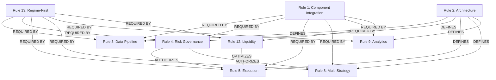
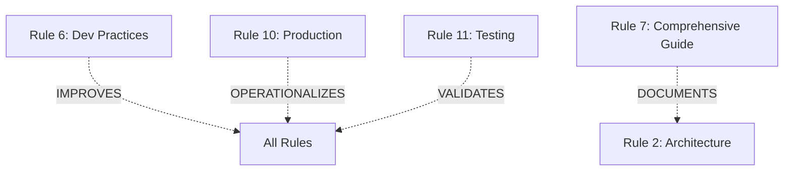

# 13 Rules Relationship Map & Integration Guide

## Visual Architecture: Rules Integration Map

```
┌─────────────────────────────────────────────────────────────────┐
│                    LAYER 0: FOUNDATION                          │
│  ┌──────────────────┐         ┌──────────────────────────┐     │
│  │   RULE 13        │         │     RULE 1               │     │
│  │ Regime-First     │◄────────┤  Component Integration   │     │
│  │  Principle       │         │      Standards           │     │
│  └────────┬─────────┘         └──────────────────────────┘     │
│           │ (Provides regime context to ALL layers)            │
└───────────┼─────────────────────────────────────────────────────┘
            │
            ▼
┌─────────────────────────────────────────────────────────────────┐
│              LAYER 1: SYSTEM ARCHITECTURE                       │
│  ┌──────────────────┐         ┌──────────────────────────┐     │
│  │   RULE 2         │◄───────►│     RULE 7               │     │
│  │ Core Engine      │         │  Comprehensive Guide     │     │
│  │  Architecture    │         │   (Extended Docs)        │     │
│  └────────┬─────────┘         └──────────────────────────┘     │
│           │ (Defines 6-layer hierarchy)                         │
└───────────┼─────────────────────────────────────────────────────┘
            │
            ▼
┌─────────────────────────────────────────────────────────────────┐
│          LAYER 2: DATA & PROCESSING                             │
│  ┌──────────────────┐         ┌──────────────────────────┐     │
│  │   RULE 3         │         │     RULE 12              │     │
│  │  Data Flow       │◄────────┤  Market Microstructure   │     │
│  │   Pipeline       │         │   & Liquidity Mgmt       │     │
│  └────────┬─────────┘         └──────────┬───────────────┘     │
│           │                               │                     │
│           │ (Single data authority)       │ (Liquidity data)   │
└───────────┼───────────────────────────────┼─────────────────────┘
            │                               │
            ▼                               │
┌─────────────────────────────────────────────────────────────────┐
│             LAYER 3: GOVERNANCE & RISK                          │
│  ┌──────────────────────────────────────────────────────┐      │
│  │                    RULE 4                             │      │
│  │              Risk Governance Patterns                 │      │
│  │         (CentralRiskManager - Single Authority)       │      │
│  └──────────────────────┬───────────────────────────────┘      │
│                         │ (Authorizes all trading)              │
└─────────────────────────┼───────────────────────────────────────┘
                          │
        ┌─────────────────┼─────────────────┐
        │                 │                 │
        ▼                 ▼                 ▼
┌─────────────────────────────────────────────────────────────────┐
│          LAYER 4: STRATEGY & ANALYTICS                          │
│  ┌──────────────────┐         ┌──────────────────────────┐     │
│  │   RULE 8         │         │     RULE 9               │     │
│  │  Multi-Strategy  │────────►│  Advanced Analytics      │     │
│  │  Coordination    │         │     Integration          │     │
│  └────────┬─────────┘         └──────────────────────────┘     │
│           │ (Strategy signals)        │ (Performance metrics)   │
└───────────┼───────────────────────────┼─────────────────────────┘
            │                           │
            ▼                           │
┌─────────────────────────────────────────────────────────────────┐
│                LAYER 5: EXECUTION                               │
│  ┌──────────────────┐         ┌──────────────────────────┐     │
│  │   RULE 5         │◄────────┤     RULE 12              │     │
│  │ Execution Engine │         │  Market Microstructure   │     │
│  │   Integration    │         │   (Liquidity models)     │     │
│  └────────┬─────────┘         └──────────────────────────┘     │
│           │ (Executes authorized trades)                        │
└───────────┼─────────────────────────────────────────────────────┘
            │
            ▼
┌─────────────────────────────────────────────────────────────────┐
│          LAYER 6: OPERATIONS & QUALITY                          │
│  ┌──────────┐    ┌──────────┐    ┌──────────────────────┐     │
│  │ RULE 6   │    │ RULE 10  │    │     RULE 11          │     │
│  │  Dev     │    │Production│    │  Testing &           │     │
│  │Practice  │    │Deployment│    │  Validation          │     │
│  └──────────┘    └──────────┘    └──────────────────────┘     │
│    (Quality)     (Operations)         (Assurance)              │
└─────────────────────────────────────────────────────────────────┘
```

## Rule Interaction Matrix

### Data Flow Interactions

| Source Rule | Target Rule | Interaction Type | Data Exchanged |
|-------------|-------------|------------------|----------------|
| Rule 13 → Rule 3 | Regime → Data Pipeline | **Context Provider** | RegimeContext |
| Rule 3 → Rule 8 | Data → Strategy | **Data Feed** | Market Data + Indicators |
| Rule 8 → Rule 4 | Strategy → Risk | **Authorization Request** | Trading Signals |
| Rule 4 → Rule 5 | Risk → Execution | **Authorization Grant** | Approved Trades |
| Rule 5 → Rule 9 | Execution → Analytics | **Performance Data** | Execution Results |
| Rule 12 → Rule 5 | Liquidity → Execution | **Market Metrics** | Liquidity Scores, Impact Estimates |
| Rule 13 → Rule 4 | Regime → Risk | **Context Update** | Regime-Adjusted Limits |
| Rule 13 → Rule 8 | Regime → Strategy | **Weight Adjustment** | Strategy Weights by Regime |

### Control Flow Interactions

| Rule | Controls | Mechanism | Enforcement |
|------|----------|-----------|-------------|
| Rule 1 | All Components | ISystemComponent interface | Compile-time + Runtime |
| Rule 2 | System Architecture | Layer hierarchy | Architectural |
| Rule 4 | All Trading | Authorization pattern | Runtime enforcement |
| Rule 13 | All Operations | Regime-first initialization | Startup sequence |

### Cross-Cutting Concerns

```
┌────────────────────────────────────────────────┐
│        CROSS-CUTTING CONCERNS                  │
│                                                │
│  Rule 1 (Component Integration)                │
│    ├─► Applies to: ALL rules                   │
│    └─► Provides: Lifecycle management          │
│                                                │
│  Rule 6 (Development Practices)                │
│    ├─► Applies to: ALL implementations         │
│    └─► Provides: Code quality standards        │
│                                                │
│  Rule 10 (Production Deployment)               │
│    ├─► Applies to: ALL components              │
│    └─► Provides: Health monitoring, DR         │
│                                                │
│  Rule 11 (Testing & Validation)                │
│    ├─► Applies to: ALL rules                   │
│    └─► Provides: Quality assurance             │
│                                                │
│  Rule 13 (Regime-First)                        │
│    ├─► Applies to: ALL operational rules       │
│    └─► Provides: Market regime context         │
│                                                │
└────────────────────────────────────────────────┘
```

## Dependency Graph

### Strong Dependencies (Required)



### Weak Dependencies (Enhancement)



## Integration Checklist

### For New Components

When implementing a new component, ensure compliance with:

- [ ] **Rule 1**: Implements ISystemComponent interface
- [ ] **Rule 2**: Registered in correct architectural layer
- [ ] **Rule 3**: Uses UnifiedDataManager (if needs data)
- [ ] **Rule 4**: Requests authorization from CentralRiskManager (if trades)
- [ ] **Rule 6**: Follows development best practices
- [ ] **Rule 10**: Implements health monitoring
- [ ] **Rule 11**: Has comprehensive test coverage
- [ ] **Rule 13**: Implements IRegimeAware (if operational)

### For New Strategies

When implementing a new strategy, ensure compliance with:

- [ ] **Rule 1**: Implements ISystemComponent
- [ ] **Rule 3**: Consumes data through pipeline
- [ ] **Rule 4**: Submits signals to CentralRiskManager
- [ ] **Rule 8**: Registers with StrategyManager
- [ ] **Rule 9**: Provides performance metrics
- [ ] **Rule 13**: Implements IRegimeAware with regime-based weighting

### For New Execution Algorithms

When implementing a new execution algorithm, ensure:

- [ ] **Rule 5**: Operates under UnifiedExecutionEngine
- [ ] **Rule 4**: Only executes authorized trades
- [ ] **Rule 12**: Uses liquidity assessment and impact models
- [ ] **Rule 13**: Adapts to regime-based execution parameters

## Rule Priority Matrix

### Critical Path (Must Understand First)

1. **Rule 1** - Component Integration (foundation)
2. **Rule 2** - Architecture (structure)
3. **Rule 13** - Regime-First (operational foundation)
4. **Rule 4** - Risk Governance (control)
5. **Rule 3** - Data Pipeline (flow)

### Operational Path (Day-to-Day Development)

1. **Rule 6** - Development Practices
2. **Rule 8** - Multi-Strategy Coordination
3. **Rule 5** - Execution Integration
4. **Rule 9** - Analytics Integration

### Production Path (Deployment)

1. **Rule 10** - Production Deployment
2. **Rule 11** - Testing & Validation
3. **Rule 12** - Liquidity Management

## Common Integration Patterns

### Pattern 1: Regime-Aware Signal Generation

```python
# Implements: Rule 1, Rule 3, Rule 8, Rule 13
class MyStrategy(EnhancedBaseStrategy, ISystemComponent, IRegimeAware):
    def __init__(self, config, regime_engine):
        # Rule 1: ISystemComponent
        super().__init__(config)
        
        # Rule 13: IRegimeAware
        self.regime_engine = regime_engine
        self.current_regime = None
    
    async def generate_signals(self, market_data):
        # Rule 13: Get regime context FIRST
        regime_context = await self.regime_engine.get_current_regime_context()
        
        # Rule 3: Process data through pipeline
        indicators = await self.calculate_indicators(market_data)
        features = await self.engineer_features(indicators)
        
        # Rule 13: Generate regime-aware signals
        raw_signals = await self._generate_raw_signals(features)
        regime_filtered = await self._filter_by_regime(raw_signals, regime_context)
        
        # Rule 8: Return signals for aggregation
        return regime_filtered
```

### Pattern 2: Authorized Trading Execution

```python
# Implements: Rule 1, Rule 4, Rule 5, Rule 12, Rule 13
async def execute_trading_decision(signal, regime_context):
    # Rule 12: Assess liquidity
    liquidity_score = await liquidity_engine.assess_liquidity_score(
        signal.symbol, signal.quantity
    )
    
    # Rule 4: Request risk authorization with regime context
    request = TradingDecisionRequest(
        symbol=signal.symbol,
        quantity=signal.quantity,
        regime=regime_context.primary_regime,  # Rule 13
        liquidity_score=liquidity_score  # Rule 12
    )
    
    authorization = await risk_manager.authorize_trading_decision(request)
    
    # Rule 5: Execute if authorized
    if authorization.authorization_level != AuthorizationLevel.REJECTED:
        # Rule 12: Use regime-optimized execution
        execution_strategy = select_strategy_for_regime(regime_context)
        result = await execution_engine.execute_authorized_trade(
            authorization, execution_strategy
        )
        
        return result
```

### Pattern 3: Multi-Strategy Coordination

```python
# Implements: Rule 1, Rule 4, Rule 8, Rule 13
async def coordinate_multi_strategy_signals(strategies, regime_context):
    # Rule 8: Collect signals from all strategies
    strategy_signals = {}
    for strategy_id, strategy in strategies.items():
        # Rule 13: Pass regime context to each strategy
        signals = await strategy.generate_signals(
            market_data, regime_context=regime_context
        )
        strategy_signals[strategy_id] = signals
    
    # Rule 8: Aggregate and resolve conflicts
    aggregated_signals = await signal_aggregator.aggregate_signals(
        strategy_signals, regime_context
    )
    
    # Rule 4: Submit for risk authorization
    authorized_signals = []
    for signal in aggregated_signals:
        auth = await risk_manager.authorize_trading_decision(signal)
        if auth.authorization_level != AuthorizationLevel.REJECTED:
            authorized_signals.append(auth)
    
    return authorized_signals
```

## Validation Checklist

### System-Wide Compliance

```python
async def validate_13_rules_compliance(system):
    """Validate system compliance with all 13 rules"""
    
    validation_results = {
        'rule_1_compliance': await validate_component_integration(system),
        'rule_2_compliance': await validate_architecture(system),
        'rule_3_compliance': await validate_data_pipeline(system),
        'rule_4_compliance': await validate_risk_governance(system),
        'rule_5_compliance': await validate_execution_integration(system),
        'rule_6_compliance': await validate_development_practices(system),
        'rule_7_compliance': True,  # Documentation rule
        'rule_8_compliance': await validate_multi_strategy(system),
        'rule_9_compliance': await validate_analytics_integration(system),
        'rule_10_compliance': await validate_production_deployment(system),
        'rule_11_compliance': await validate_testing_standards(system),
        'rule_12_compliance': await validate_liquidity_management(system),
        'rule_13_compliance': await validate_regime_first_principle(system)
    }
    
    all_compliant = all(validation_results.values())
    compliance_score = sum(validation_results.values()) / len(validation_results) * 100
    
    return {
        'all_compliant': all_compliant,
        'compliance_score': compliance_score,
        'validation_results': validation_results
    }
```

## Summary

The 13 rules form a **comprehensive, non-conflicting institutional trading framework** with:

✅ **Clear Hierarchy**: Layer 0 (Regime-First) → Layer 6 (Operations)  
✅ **Strong Complementarity**: Each rule enhances others  
✅ **No Conflicts**: Clear separation of concerns  
✅ **Complete Coverage**: All institutional requirements addressed  
✅ **Practical Integration**: Clear patterns for implementation  

**Next Steps**:
1. Use this map for onboarding new developers
2. Reference during component development
3. Validate compliance during code reviews
4. Update when adding Rules 14-18 (future enhancements)

---

**Document Status**: ✅ COMPLETE  
**Version**: 1.0  
**Last Updated**: 2025-10-15

