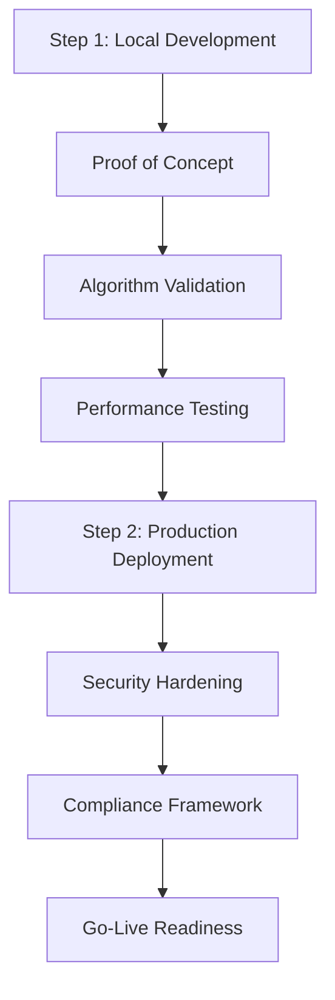

# Engineering Overhaul Roadmap
**Complete Implementation Guide for TradeDesk Architecture**

## Executive Summary

This document outlines the comprehensive engineering overhaul required to implement the institutional-grade TradeDesk Architecture. The roadmap transforms the conceptual design into a production-ready trading system through a **two-step implementation approach**: local development followed by production cloud deployment.

**Two-Step Implementation Strategy:**

### Step 1: Local Environment Implementation (12 weeks)
- **Focus**: Rapid prototyping and validation
- **Team Size**: 4-6 engineers (Backend, DevOps, ML, QA)
- **Budget**: $200-400K (tooling, development resources)
- **Deliverable**: Fully functional trading system running locally
- **Detailed Plan**: [Step 1: Local Environment Implementation](./Step1_Local_Environment_Implementation.md)

### Step 2: Production Cloud Deployment (16 weeks)
- **Focus**: Enterprise-grade cloud infrastructure
- **Team Size**: 8-12 engineers (DevOps, Security, Backend, SRE, Compliance)
- **Budget**: $2-3M (cloud infrastructure, security, compliance)
- **Deliverable**: Mission-critical production trading system
- **Detailed Plan**: [Step 2: Production Cloud Deployment](./Step2_Production_Cloud_Deployment.md)

**Total Implementation Scope:**
- **Duration**: 28 weeks (7 months)
- **Team Size**: 4-12 engineers (scaling from Step 1 to Step 2)
- **Budget**: $2.2-3.4M (development + production infrastructure)
- **Deliverable**: Production-ready institutional trading system

## 🛠️ **Technology Stack & Implementation Languages**

### **Multi-Language Architecture Strategy**

**Primary Languages by Component:**

```yaml
Language Distribution:
  Python (70%):     # Primary development language
    - Strategy development and research
    - Machine learning pipeline (regime detection)
    - API services and orchestration
    - Data analysis and reporting
    - Rapid prototyping and backtesting
    
  Java (20%):       # Enterprise services
    - Risk management services
    - Execution engine and order management
    - Market data processing
    - Enterprise integration and compliance
    
  C++ (5%):         # Ultra-low latency components
    - Market data feed handlers
    - Order execution core
    - Critical risk calculations
    - High-frequency trading components
    
  Go (5%):          # Infrastructure and DevOps
    - Kubernetes operators
    - Monitoring and CLI tools
    - Infrastructure services
    - Cloud-native automation
```

### **Implementation Strategy Rationale**

**Python-First Development:**
- **Development Velocity**: 3-5x faster development than compiled languages
- **ML Ecosystem**: Unmatched financial and machine learning libraries
- **Team Productivity**: Easier hiring, faster onboarding, rapid iteration
- **Prototyping**: Quick algorithm validation and system testing

**Strategic Java Integration:**
- **Enterprise Maturity**: Proven in financial institutions
- **Performance**: JVM optimization for long-running services
- **Concurrency**: Excellent for multi-threaded trading operations
- **Ecosystem**: Spring Boot, enterprise patterns, extensive tooling

**Selective C++ Optimization:**
- **Microsecond Latency**: Critical for institutional trading requirements
- **Memory Control**: Precise optimization for performance-critical paths
- **Hardware Integration**: SIMD, cache optimization, CPU affinity

**Go for Cloud Operations:**
- **Cloud Native**: Perfect for Kubernetes and infrastructure automation
- **Deployment Simplicity**: Single binary, fast compilation
- **Concurrency**: Goroutines for concurrent infrastructure operations

---

## 📋 Two-Step Implementation Overview

### Phase Comparison Matrix

| Aspect | Step 1: Local Development | Step 2: Production Cloud |
|--------|---------------------------|--------------------------|
| **Duration** | 12 weeks | 16 weeks |
| **Team Size** | 4-6 engineers | 8-12 engineers |
| **Primary Language** | Python (80%) + Java (15%) + Go (5%) | Python (65%) + Java (25%) + C++ (5%) + Go (5%) |
| **Infrastructure** | Docker Compose, Local K8s | Managed AWS Services |
| **Database** | PostgreSQL + TimescaleDB | RDS Aurora + Timestream |
| **Message Queue** | Single Kafka Instance | AWS MSK Cluster |
| **Monitoring** | Prometheus + Grafana | AWS Managed Prometheus/Grafana |
| **Security** | Basic auth, local certs | Enterprise IAM, Vault, mTLS |
| **Scaling** | Manual, limited | Auto-scaling, unlimited |
| **Cost** | $200-400K | $2-3M annually |
| **Latency Target** | < 10ms (Python) | < 100 microseconds (C++) |
| **Throughput** | 1,000 orders/sec | 100,000 orders/sec |
| **Availability** | 95% | 99.99% |

### Implementation Path



### Prerequisites and Migration Path

**Step 1 Prerequisites:**
- Docker and Docker Compose installed
- Development team assembled
- Basic infrastructure budget approved
- Local development environment setup

**Step 1 to Step 2 Migration:**
- Architecture validation completed
- Performance benchmarks met
- Security review passed
- Production team onboarded
- Cloud infrastructure budget approved
- Compliance requirements documented

---

## 🏗️ Original Implementation Phases (Consolidated Reference)

*Note: The detailed implementation has been restructured into the two-step approach above. The original four-phase plan below serves as a comprehensive reference for the complete scope.*
**Building the Technology Foundation**

### 1.1 Container & Orchestration Infrastructure

**Kubernetes Cluster Setup:**
```yaml
Development Environment:
- 3-node Kubernetes cluster (local/cloud)
- Istio service mesh installation
- Ingress controller (NGINX/Traefik)
- Cert-manager for TLS automation

Production Environment:
- Multi-zone Kubernetes cluster (AWS EKS/GCP GKE)
- High-availability control plane
- Auto-scaling node groups
- Network policies and security hardening
```

**Custom Kubernetes Operators:**
```go
Trading System Operators:
- TradingCluster operator for system lifecycle
- StrategyDeployment operator for strategy management
- RiskConfiguration operator for risk parameter updates
- DataPipeline operator for streaming job management
```

**GitOps Pipeline:**
```yaml
ArgoCD Configuration:
- Multi-environment deployment (dev/staging/prod)
- Automated rollback capabilities
- Configuration drift detection
- Secret management integration
```

### 1.2 Data Infrastructure

**Time-Series Database Setup:**
```yaml
InfluxDB Enterprise Cluster:
- 3-node cluster with replication
- Retention policies for different data types
- Continuous queries for real-time aggregations
- Backup and disaster recovery configuration

Schema Design:
- Market data measurements
- Trading metrics measurements
- System performance measurements
- Custom analytics measurements
```

**Operational Database:**
```sql
PostgreSQL + TimescaleDB:
- Master-slave replication setup
- Partitioning strategies for large tables
- Connection pooling (PgBouncer)
- Automated backup and point-in-time recovery

Core Schema:
- User management and permissions
- Trading strategies and configurations
- Risk parameters and limits
- Audit logs and compliance data
```

**Caching Infrastructure:**
```yaml
Redis Cluster:
- 6-node cluster (3 masters, 3 replicas)
- Sentinel for automatic failover
- Memory optimization settings
- Persistence configuration for critical data
```

**Event Streaming Platform:**
```yaml
Apache Kafka Cluster:
- 3-broker cluster with Zookeeper
- Topic partitioning strategies
- Retention policies by data type
- Schema registry for event schemas
- Kafka Connect for external integrations
```

### 1.3 Monitoring & Observability

**Metrics Collection:**
```yaml
Prometheus Setup:
- Multi-tenant configuration
- Federation for cross-cluster metrics
- Custom trading metrics exporters
- Long-term storage (Thanos/Cortex)

Custom Metrics:
- Trading latency histograms
- Order execution rates
- Risk metrics and breaches
- Strategy performance indicators
```

**Visualization & Alerting:**
```yaml
Grafana Dashboards:
- System health overview
- Trading performance metrics
- Risk management dashboard
- Operational metrics dashboard

Alert Manager:
- PagerDuty integration
- Slack/Teams notifications
- Escalation policies
- Alert suppression rules
```

**Distributed Tracing:**
```yaml
Jaeger Configuration:
- All-in-one deployment for development
- Production deployment with Elasticsearch
- Sampling strategies for high-throughput
- Custom span tags for trading operations
```

**Centralized Logging:**
```yaml
ELK Stack:
- Elasticsearch cluster (3 nodes)
- Logstash for log processing
- Kibana for log analysis
- Fluentd for log collection from pods
```

### 1.4 Security Infrastructure

**Identity & Access Management:**
```yaml
Keycloak Setup:
- High-availability deployment
- LDAP/AD integration
- RBAC configuration
- OAuth 2.0/OIDC providers
```

**Secrets Management:**
```yaml
HashiCorp Vault:
- High-availability configuration
- Kubernetes auth method
- Database secrets engine
- PKI secrets engine for certificates
```

**Network Security:**
```yaml
Istio Security:
- Mutual TLS between services
- Authorization policies
- Request authentication
- Security scanning integration
```

---

## 🔧 Phase 2: Core Services Framework (Weeks 5-12)
**Building Scalable Service Architecture**

### 2.1 Microservices Foundation

**Service Template Framework:**
```python
FastAPI Service Template:
- Standardized project structure
- Common middleware (auth, logging, metrics)
- Health check endpoints
- OpenAPI documentation generation
- Async/await patterns throughout

Spring Boot Service Template:
- Enterprise Java patterns
- Reactive programming (WebFlux)
- Circuit breaker patterns (Resilience4j)
- Distributed tracing integration
- JVM optimization for trading workloads
```

**Common Libraries:**
```yaml
Python Trading Commons:
- Authentication/authorization utilities
- Metrics collection decorators
- Logging configuration
- Database connection management
- Event publishing/subscribing

Java Trading Commons:
- Risk calculation utilities
- Order management abstractions
- Market data handling
- Performance monitoring
- Exception handling patterns
```

### 2.2 API & Communication Standards

**gRPC Service Definitions:**
```protobuf
Market Data Services:
- MarketDataService.proto
- HistoricalDataService.proto
- DataQualityService.proto

Trading Services:
- RiskManagementService.proto
- StrategyService.proto
- ExecutionService.proto
- PortfolioService.proto

System Services:
- ConfigurationService.proto
- MonitoringService.proto
- AuditService.proto
```

**REST API Specifications:**
```yaml
OpenAPI Specifications:
- External client APIs
- Administrative interfaces
- Reporting endpoints
- Configuration management APIs

GraphQL Federation:
- Unified data access layer
- Cross-service query optimization
- Real-time subscriptions
- Performance monitoring
```

**Event Schemas:**
```yaml
Kafka Topic Schemas:
- market-data-events (Avro)
- trading-signals (JSON Schema)
- risk-alerts (Avro)
- portfolio-updates (JSON Schema)
- system-events (JSON Schema)
```

### 2.3 Data Pipeline Implementation

**Market Data Ingestion:**
```python
Data Ingestion Services:
- Multi-feed handler architecture
- Protocol adapters (FIX, WebSocket, REST)
- Real-time data validation
- Failover and redundancy handling
- Latency measurement and monitoring

Data Quality Pipeline:
- Real-time anomaly detection
- Cross-venue validation
- Missing data interpolation
- Quality scoring algorithms
- Alert generation and routing
```

**Stream Processing:**
```java
Apache Flink Jobs:
- Real-time data transformation
- Complex event processing
- Windowing and aggregations
- Exactly-once processing guarantees
- Checkpoint and recovery mechanisms

Processing Pipelines:
- Market data normalization
- Signal generation preprocessing
- Risk calculation preprocessing
- Performance analytics streaming
```

### 2.4 Event Sourcing Foundation

**Event Store Implementation:**
```python
Event Sourcing Framework:
- Aggregate root patterns
- Event versioning strategies
- Snapshot generation
- Event replay capabilities
- Projection management

Command/Query Separation:
- Command handlers
- Query model builders
- Read model optimizations
- Eventual consistency handling
```

---

## 🧠 Phase 3: Intelligence & Trading Engine (Weeks 13-20)
**Implementing Core Trading Logic**

### 3.1 RiskManager Central Hub

**Ultra-Low Latency Risk Engine:**
```cpp
C++ Risk Calculation Engine:
- Lock-free data structures
- SIMD optimizations for calculations
- Memory pool management
- CPU affinity configuration
- RDMA for inter-node communication

Risk Calculations:
- Real-time VaR/CVaR computation
- Portfolio exposure tracking
- Correlation matrix updates
- Stress testing scenarios
- Monte Carlo simulations
```

**Risk Management Services:**
```java
Java Risk Services:
- Risk limit enforcement
- Position size validation
- Exposure aggregation
- Compliance monitoring
- Real-time alerting

Integration Points:
- Strategy service validation
- Execution service authorization
- Portfolio service coordination
- Audit service logging
```

### 3.2 UnifiedRegimeEngine Implementation

**Machine Learning Pipeline:**
```python
Regime Detection Models:
- Hidden Markov Models (scikit-learn)
- Gaussian Mixture Models (scikit-learn)
- Ensemble classifiers (XGBoost, Random Forest)
- Deep learning models (TensorFlow/PyTorch)
- Online learning algorithms

Feature Engineering:
- Technical indicators calculation
- Cross-asset correlation features
- Volatility surface features
- Market microstructure features
- Alternative data integration
```

**MLOps Infrastructure:**
```yaml
Model Lifecycle Management:
- MLflow for experiment tracking
- Model registry and versioning
- Automated training pipelines
- A/B testing framework
- Performance monitoring

Deployment Pipeline:
- Model packaging (Docker)
- Kubernetes model serving
- Canary deployments
- Rollback capabilities
- Performance benchmarking
```

### 3.3 Strategy Framework

**Strategy Engine Architecture:**
```python
Pluggable Strategy Framework:
- Abstract strategy base classes
- Signal generation interfaces
- Parameter management
- Performance tracking
- Risk integration

Built-in Strategies:
- Mean reversion strategies
- Momentum strategies
- Pairs trading strategies
- Cross-asset arbitrage
- Custom strategy templates
```

### 3.4 Execution Engine

**Order Management System:**
```cpp
C++ Execution Engine:
- FIX protocol implementation
- Smart order routing
- Algorithm selection engine
- Market impact modeling
- Transaction cost analysis

Execution Algorithms:
- TWAP (Time-Weighted Average Price)
- VWAP (Volume-Weighted Average Price)
- Implementation Shortfall
- Participation Rate algorithms
- Custom execution strategies
```

---

## ⚡ Phase 4: Performance & Production Readiness (Weeks 21-28)
**Optimization and Production Deployment**

### 4.1 Performance Optimization

**Latency Optimization:**
```cpp
Ultra-Low Latency Techniques:
- DPDK network stack integration
- Kernel bypass mechanisms
- CPU core isolation
- Huge pages configuration
- Lock-free programming patterns

Benchmarking Framework:
- Latency measurement tools
- Throughput testing
- Resource utilization monitoring
- Performance regression detection
- Optimization validation
```

**Throughput Optimization:**
```yaml
Scaling Strategies:
- Horizontal pod autoscaling
- Vertical pod autoscaling
- Resource quotas and limits
- Load balancing algorithms
- Connection pooling optimization

Performance Testing:
- Load testing (k6, JMeter)
- Stress testing protocols
- Endurance testing
- Spike testing scenarios
- Chaos engineering
```

### 4.2 Security & Compliance

**Security Implementation:**
```yaml
Comprehensive Security:
- mTLS between all services
- API rate limiting and throttling
- Input validation and sanitization
- SQL injection prevention
- Cross-site scripting protection

Compliance Framework:
- GDPR compliance measures
- Financial regulatory compliance
- Audit trail completeness
- Data retention policies
- Privacy protection mechanisms
```

### 4.3 Operational Excellence

**Monitoring & Alerting:**
```yaml
Production Monitoring:
- Real-time trading dashboards
- System health indicators
- Performance SLA monitoring
- Capacity planning metrics
- Cost optimization tracking

Alert Management:
- Intelligent alert routing
- Alert correlation and suppression
- Escalation procedures
- Incident response automation
- Post-incident analysis
```

**Backup & Disaster Recovery:**
```yaml
Business Continuity:
- Automated backup procedures
- Cross-region data replication
- Disaster recovery testing
- RTO/RPO validation
- Failover automation

Recovery Procedures:
- Database recovery playbooks
- Service restoration procedures
- Data integrity validation
- Performance restoration
- Client communication protocols
```

---

## 📋 Updated Implementation Checklist

### Step 1: Local Development Environment
- [ ] Docker Compose infrastructure stack
- [ ] Service development templates
- [ ] Market data simulation framework
- [ ] Local risk management system
- [ ] ML pipeline development
- [ ] Testing and CI/CD framework
- [ ] Performance benchmarking
- [ ] Documentation and guides

### Step 2: Production Cloud Deployment
- [ ] AWS/Cloud infrastructure provisioning
- [ ] Enterprise security implementation
- [ ] Managed services integration
- [ ] Production monitoring stack
- [ ] Compliance and audit framework
- [ ] Disaster recovery setup
- [ ] Performance optimization
- [ ] Go-live preparation

---

## 🎯 Updated Success Metrics

### Step 1: Local Development Targets
- **Setup Time**: < 30 minutes for new developer onboarding
- **Latency**: < 10ms for risk calculations (local)
- **Throughput**: > 1,000 orders/second (simulated)
- **Test Coverage**: > 80% for all services
- **Memory Usage**: < 8GB RAM for complete stack

### Step 2: Production Targets
- **Latency**: < 100 microseconds for risk calculations
- **Throughput**: > 100,000 orders/second
- **Availability**: 99.99% uptime SLA
- **Security**: Zero security incidents
- **Compliance**: 100% audit compliance

---

## 🚀 Next Steps

### Immediate Actions (Step 1)
1. **Team Assembly**: Recruit local development team (4-6 engineers)
2. **Environment Setup**: Provision development infrastructure and tooling
3. **Sprint Planning**: Create detailed sprint plans for 12-week local development
4. **Documentation Review**: Study detailed Step 1 implementation guide
5. **Budget Approval**: Secure development phase funding ($200-400K)

### Future Actions (Step 2)
1. **Production Team Assembly**: Scale team to 8-12 engineers with cloud expertise
2. **Cloud Architecture Review**: Validate production architecture with cloud architects
3. **Security Assessment**: Conduct comprehensive security and compliance review
4. **Infrastructure Procurement**: Secure production cloud infrastructure budget
5. **Go-Live Planning**: Develop comprehensive production deployment strategy

**Detailed Implementation Guides:**
- [Step 1: Local Environment Implementation](./Step1_Local_Environment_Implementation.md)
- [Step 2: Production Cloud Deployment](./Step2_Production_Cloud_Deployment.md)

This two-step approach provides a practical path from concept to production, enabling rapid validation and iterative development while ensuring enterprise-grade production deployment.