# 🔗 Implementation Dependencies & Execution Roadmap

## 📊 Critical Path Analysis

### **Dependency Chain Overview**
```
Foundation → Templates → Adaptation → Orchestration → Testing
    ↓           ↓           ↓            ↓            ↓
  Week 1-2   Week 3-4    Week 5      Week 6       Week 7
```

## 🎯 Phase Dependencies Matrix

| Phase | Depends On | Blocks | Critical Path | Risk Level |
|-------|------------|--------|---------------|------------|
| **Phase 1: Foundation** | None | All others | ✅ YES | 🔴 HIGH |
| **Phase 2: Templates** | Phase 1 complete | Phase 3, 4 | ✅ YES | 🟡 MEDIUM |
| **Phase 3: Adaptation** | Phase 1, 2 | Phase 4 | ⚠️ PARTIAL | 🟡 MEDIUM |
| **Phase 4: Orchestration** | Phase 1, 2, 3 | Phase 5 | ⚠️ PARTIAL | 🟢 LOW |
| **Phase 5: Testing** | All phases | None | ❌ NO | 🟢 LOW |

## 🚀 Execution Strategy

### **Parallel Execution Opportunities**

#### Week 1-2: Foundation + Template Prep

```mermaid
gantt
    title Foundation Architecture Implementation
    dateFormat  X
    axisFormat %d
    
    section Core Engine
    Interface Creation     :1, 3
    Delegation Logic      :4, 6
    
    section Configuration
    Config Manager        :8, 10
    
    section Template Prep
    Directory Structure   :2, 3
    Template Schema      :4, 6
```


**Parallel Tasks:**
- Core Engine Interface Creation (Days 1-3)
- Template Directory Setup (Days 2-3) **[PARALLEL]**
- Signal Converter Implementation (Days 4-5)
- Template Schema Design (Days 4-6) **[PARALLEL]**

#### Week 3-4: Templates + Adaptation Design

```mermaid
gantt
    title Template & Adaptation Preparation
    dateFormat  X
    axisFormat %d
    
    section Templates
    Template Infrastructure  :11, 13
    Momentum Template       :14, 16
    Template Bridge         :17, 18
    
    section Adaptation Design
    Adaptation Architecture :12, 14
    Parameter Validation    :15, 17
```


**Parallel Tasks:**
- Template Infrastructure (Days 11-13)
- Adaptation Architecture Design (Days 12-14) **[PARALLEL]**
- Momentum Template Creation (Days 14-16)
- Parameter Validation Design (Days 15-17) **[PARALLEL]**

## 📋 Daily Implementation Checklist

### **Phase 1: Foundation Architecture (Week 1-2)**

#### Days 1-3: Core Engine Interfaces
- [ ] **Day 1 Morning**: Create `StrategyInterface` abstract class
- [ ] **Day 1 Afternoon**: Create `PortfolioInterface` abstract class
- [ ] **Day 2 Morning**: Create `ExecutionInterface` abstract class
- [ ] **Day 2 Afternoon**: Implement delegation pattern in `UnifiedCoreEngine`
- [ ] **Day 3 Morning**: Remove strategy-specific logic from core engine
- [ ] **Day 3 Afternoon**: Unit tests for interface delegation

**Validation Criteria:**
```python
# Must pass these tests
def test_core_engine_delegation():
    core_engine = UnifiedCoreEngine()
    assert not hasattr(core_engine, 'calculate_momentum')
    assert not hasattr(core_engine, '_momentum_logic')
    assert hasattr(core_engine, 'strategy_interface')
```

#### Days 4-5: Signal Converter Isolation
- [ ] **Day 4 Morning**: Create pure `SignalConverter` class
- [ ] **Day 4 Afternoon**: Implement signal validation logic
- [ ] **Day 5 Morning**: Move all signal conversion from core engine
- [ ] **Day 5 Afternoon**: Integration tests for signal flow

**Validation Criteria:**
```python
def test_signal_converter_isolation():
    converter = SignalConverter()
    raw_signals = {"TSLA": {"momentum": -0.005, "confidence": 0.9}}
    trading_signals = converter.convert_to_trading_signals(raw_signals)
    assert len(trading_signals) == 1
    assert trading_signals[0].signal_type == SignalType.SHORT
```

#### Days 6-7: Remove Backfall Mechanisms
- [ ] **Day 6 Morning**: Identify all fallback logic
- [ ] **Day 6 Afternoon**: Replace with explicit error handling
- [ ] **Day 7 Morning**: Remove default parameter fallbacks
- [ ] **Day 7 Afternoon**: Test fail-fast behavior

**Validation Criteria:**
```python
def test_no_fallback_mechanisms():
    with pytest.raises(ComponentMissingError):
        core_engine = UnifiedCoreEngine()
        core_engine.process_trading_cycle(None)  # Should fail fast
```

#### Days 8-10: Centralized Configuration
- [ ] **Day 8 Morning**: Design `UnifiedConfigurationManager`
- [ ] **Day 8 Afternoon**: Implement configuration loading
- [ ] **Day 9 Morning**: Implement configuration validation
- [ ] **Day 9 Afternoon**: Implement configuration caching
- [ ] **Day 10 Morning**: Integration with existing components
- [ ] **Day 10 Afternoon**: Performance optimization

**Validation Criteria:**
```python
def test_unified_configuration():
    config_manager = UnifiedConfigurationManager()
    config = config_manager.load_strategy_configuration("momentum_v1")
    assert config.strategy_config is not None
    assert config.risk_config is not None
```

### **Phase 2: Strategy Template System (Week 3-4)**

#### Days 11-13: Template Infrastructure
- [ ] **Day 11 Morning**: Implement `BaseTemplate` class
- [ ] **Day 11 Afternoon**: Implement `TemplateRegistry`
- [ ] **Day 12 Morning**: Implement template validation
- [ ] **Day 12 Afternoon**: Implement template inheritance
- [ ] **Day 13 Morning**: Implement parameter bounds system
- [ ] **Day 13 Afternoon**: Unit tests for template system

#### Days 14-16: Momentum Template Creation
- [ ] **Day 14 Morning**: Design professional momentum template
- [ ] **Day 14 Afternoon**: Implement signal definitions
- [ ] **Day 15 Morning**: Implement risk definitions
- [ ] **Day 15 Afternoon**: Implement entry/exit definitions
- [ ] **Day 16 Morning**: Implement adaptation framework
- [ ] **Day 16 Afternoon**: Template validation tests

#### Days 17-18: Template-Strategy Bridge
- [ ] **Day 17 Morning**: Implement `TemplateStrategyBridge`
- [ ] **Day 17 Afternoon**: Implement template conversion logic
- [ ] **Day 18 Morning**: Integration with strategy layer
- [ ] **Day 18 Afternoon**: End-to-end template tests

### **Phase 3: Dynamic Parameter System (Week 5)**

#### Days 19-21: Real-Time Parameter Adaptation
- [ ] **Day 19 Morning**: Replace mock optimization with real metrics
- [ ] **Day 19 Afternoon**: Implement actual Sharpe ratio calculation
- [ ] **Day 20 Morning**: Implement win rate calculation
- [ ] **Day 20 Afternoon**: Implement profit factor calculation
- [ ] **Day 21 Morning**: Implement parameter adjustment logic
- [ ] **Day 21 Afternoon**: Testing with real performance data

#### Days 22-23: Parameter Bounds Validation
- [ ] **Day 22 Morning**: Implement `ParameterValidator`
- [ ] **Day 22 Afternoon**: Implement range validation
- [ ] **Day 23 Morning**: Implement type validation
- [ ] **Day 23 Afternoon**: Implement cross-parameter validation

#### Days 24-25: Adaptation Rollback Mechanism
- [ ] **Day 24 Morning**: Implement `AdaptationRollbackManager`
- [ ] **Day 24 Afternoon**: Implement snapshot creation
- [ ] **Day 25 Morning**: Implement performance monitoring
- [ ] **Day 25 Afternoon**: Implement rollback execution

### **Phase 4: Scenario Orchestration (Week 6)**

#### Days 26-28: Scenario Orchestrator Implementation
- [ ] **Day 26 Morning**: Design `ScenarioOrchestrator` class
- [ ] **Day 26 Afternoon**: Implement scenario configuration
- [ ] **Day 27 Morning**: Implement scenario execution logic
- [ ] **Day 27 Afternoon**: Implement adaptation integration
- [ ] **Day 28 Morning**: Implement result aggregation
- [ ] **Day 28 Afternoon**: Integration testing

#### Days 29-30: Test Case Refactoring
- [ ] **Day 29 Morning**: Refactor test case to use orchestration
- [ ] **Day 29 Afternoon**: Remove orchestration logic from test
- [ ] **Day 30 Morning**: Implement result conversion
- [ ] **Day 30 Afternoon**: Validate test case simplification

### **Phase 5: Integration Testing (Week 7)**

#### Days 31-33: Integration Testing Suite
- [ ] **Day 31 Morning**: Create integration test framework
- [ ] **Day 31 Afternoon**: Test template-to-execution flow
- [ ] **Day 32 Morning**: Test adaptation integration
- [ ] **Day 32 Afternoon**: Test boundary violation prevention
- [ ] **Day 33 Morning**: Test performance regression
- [ ] **Day 33 Afternoon**: Test error handling

#### Days 34-35: Performance Optimization
- [ ] **Day 34 Morning**: Profile critical paths
- [ ] **Day 34 Afternoon**: Optimize signal processing
- [ ] **Day 35 Morning**: Optimize adaptation performance
- [ ] **Day 35 Afternoon**: Final performance validation

## ⚠️ Risk Mitigation Strategies

### **Critical Path Risks**

#### Risk 1: Phase 1 Delays
**Impact**: Blocks all subsequent phases
**Mitigation**:
- Daily standup meetings during Phase 1
- Parallel preparation work for Phase 2
- Feature flag implementation for gradual rollout

#### Risk 2: Integration Complexity
**Impact**: Failed integration between phases
**Mitigation**:
- Integration tests at each phase boundary
- Incremental integration approach
- Rollback capability for each phase

#### Risk 3: Performance Degradation
**Impact**: System slower than before
**Mitigation**:
- Performance benchmarks before changes
- Continuous performance monitoring
- Optimization built into each phase

### **Resource Management**

#### Developer Allocation
```
Phase 1: 2 Senior Developers (Foundation critical)
Phase 2: 1 Senior + 1 Mid (Template design)
Phase 3: 1 Senior + 1 Mid (Adaptation logic)
Phase 4: 1 Senior (Orchestration)
Phase 5: 2 Senior (Integration validation)
```

#### Code Review Strategy
- Daily code reviews during Phase 1
- Architectural reviews at phase boundaries
- Performance reviews before deployment
- Security reviews for all interfaces

## 🎯 Success Metrics & Validation

### **Phase Completion Criteria**

#### Phase 1 Complete When:
- [ ] All boundary violation tests pass
- [ ] No fallback mechanisms remain
- [ ] Core engine has zero strategy logic
- [ ] Configuration centralized and working

#### Phase 2 Complete When:
- [ ] Professional momentum template created
- [ ] Template-to-strategy conversion works
- [ ] Parameter bounds properly enforced
- [ ] Template validation complete

#### Phase 3 Complete When:
- [ ] Real performance metrics replace mocks
- [ ] Parameter adaptation validated
- [ ] Rollback mechanism functional
- [ ] Adaptation bounds enforced

#### Phase 4 Complete When:
- [ ] Scenario orchestration functional
- [ ] Test cases simplified
- [ ] Clean orchestration separation
- [ ] Result tracking complete

#### Phase 5 Complete When:
- [ ] All integration tests pass
- [ ] Performance meets benchmarks
- [ ] Documentation complete
- [ ] System production-ready

### **Automated Validation Pipeline**

```yaml
# .github/workflows/phase-validation.yml
name: Phase Validation Pipeline

on:
  push:
    branches: [ main, phase/* ]

jobs:
  phase-1-validation:
    if: contains(github.ref, 'phase/1')
    runs-on: ubuntu-latest
    steps:
      - name: Test Boundary Violations
        run: pytest tests/boundaries/
      - name: Test Configuration System
        run: pytest tests/configuration/
      - name: Test Interface Delegation
        run: pytest tests/interfaces/

  phase-2-validation:
    if: contains(github.ref, 'phase/2')
    runs-on: ubuntu-latest
    steps:
      - name: Test Template System
        run: pytest tests/templates/
      - name: Test Template Conversion
        run: pytest tests/conversion/

  # Continue for all phases...
```

This roadmap provides the detailed execution plan needed to implement all architectural fixes systematically while managing dependencies and risks effectively.
